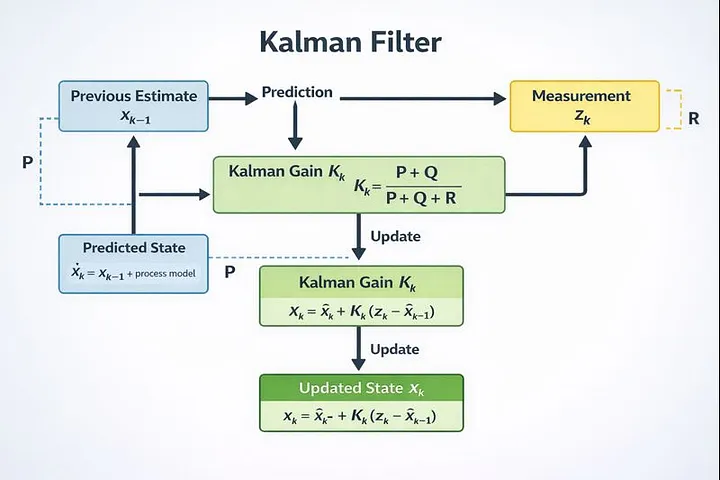

# EtheRadar

# Description
**EtheRadar** is a handheld device based on the ESP32 microcontroller, designed for monitoring, analyzing and locating signals within the 2.4GHz radio spectrum (Wi-Fi). The device scans the environment and provides real-time visual feedback based on signal strength (RSSI - Received Signal Strength Indicator), allowing the user to track the proximity of the closest device.  
Key features include:  
- Dynamic Tracking: Ability to lock onto and track signals.
- Device Whitelisting: Users can save specific MAC addresses to internal memory.
- Sentry Mode: A filtering option that ignores saved (known) devices and exclusively scans for new, unknown signals (can be used to alert the user to potential unauthorized devices).

# Bill Of Materials (BOM)
- ESP32 Development board
- TFT Display OKY4029
- Encoder with button OKY3431-4
- Passive Buzzer
- Breadboard

# Questions
* **What is the system boundary?**  
  *Answer*: The system boundary is defined physically and electromagnetically by the effective range of the ESP32's PCB antenna (the local 2.4GHz spectrum).
* **Where does intelligence live?**  
  *Answer*: The intelligence resides within the ESP32, specifically in the filtering algorithm that distinguishes between background noise and relevant signals, the whitelisting logic that decides whether a device is a new threat or a known object and the mapping of logarithmic values (dBm) into linear sensory feedback.
* **What is the hardest technical problem?**  
  *Answer*: The most significant technical challenge is handling the blocking nature of the Wi-Fi scan operation. The standard WiFi.scanNetworks() function stops code execution for several seconds.
* **What is the minimum demo?**  
  *Answer*: The device boots up autonomously. It displays a list of detected networks. The user selects a network from the list and the screen enters Radar Mode.
* **Why is this not just a tutorial?**  
  *Answer*: Online tutorials stop at displaying network names. EtheRadar adds layers of complexity.
* **Do you need an ESP32?**  
  *Answer*: Yes, this project requires an ESP32 because it has the integrated Wi-Fi radio module. But I already bought one myself, so there is no need to buy one for me.

# Problems that i have encountered when developing the project and how I solved them

* **Real-Time Signal Tracking Optimization:** To address latency issues caused by blocking WiFi scan operations, the system utilizes asynchronous scanning methods. The tracking workflow is optimized by performing an initial full-spectrum scan to identify targets, after which the WiFi radio locks onto the specific channel of the selected AP. This channel-locking mechanism significantly increases the RSSI sampling rate and system responsiveness.
* **Distance Estimation & Signal Smoothing:** Distance Calculation is derived from RSSI (Received Signal Strength Indicator) values. To mitigate the impact of signal noise, multi-path interference, and fluctuation spikes common in raw RSSI data, a **Kalman Filter** implementation was integrated. This algorithm stabilizes the signal input before conversion, ensuring a smoother and more reliable distance estimation.   
Source: https://medium.com/@tidaschandoopasilva/estimating-distance-using-wi-fi-rssi-on-esp32-2fc47bed0732
### **Kalman Filter diagram.**

* **Sentry Mode Resource Management:** Optimized the intrusion detection logic by implementing a RAM-based caching system. Upon initializing Sentry Mode, the "Whitelist" of known SSIDs is loaded from non-volatile storage (Flash) into volatile memory (RAM). This eliminates repetitive Flash I/O operations during the periodic 10-second environment scans, improving comparison speed.

### Circuit pinouts
>* TFT:  
&nbsp;&nbsp;GND -> GND  
&nbsp;&nbsp;VCC -> 3.3V  
&nbsp;&nbsp;SCK -> GPIO18  
&nbsp;&nbsp;SDA -> GPIO23  
&nbsp;&nbsp;RES -> 22  
&nbsp;&nbsp;DC  -> 21  
&nbsp;&nbsp;BLK -> 3.3V

>* Encoder:  
&nbsp;&nbsp;VCC -> 3.3V  
&nbsp;&nbsp;KEY(SW) -> GPIO27    
&nbsp;&nbsp;S1(CLOCK) -> GPIO25  
&nbsp;&nbsp;S2(DT) -> GPIO26  

>* Buzzer:  
&nbsp;&nbsp;(+) -> GPIO14  
&nbsp;&nbsp;(-) -> 330R -> GND